## Sorting algorithms time complexity
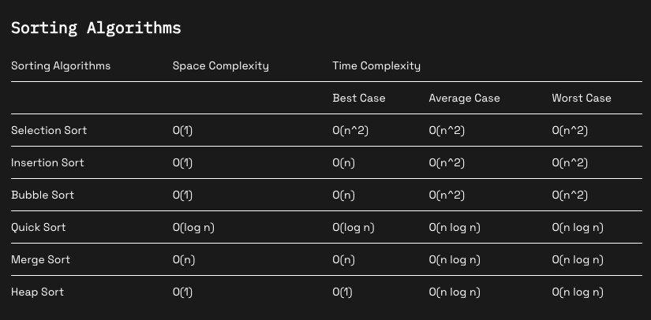

### Tim Sort (sorted using in Python)
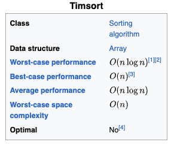

## Search algorithms
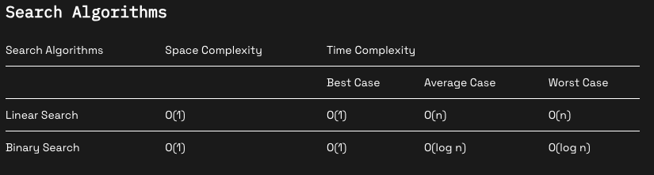

## Python Dequeue
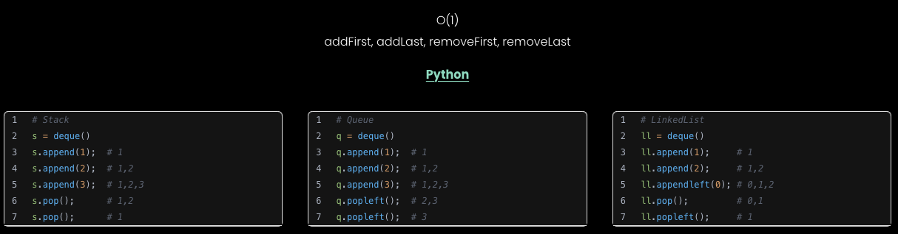

# DFS Algorithm

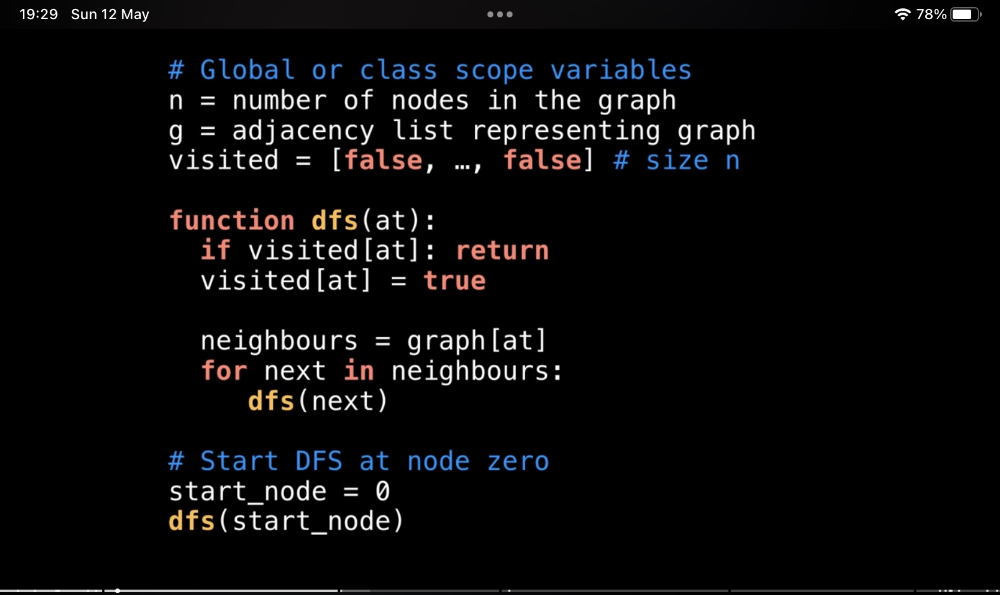

## Count separated components
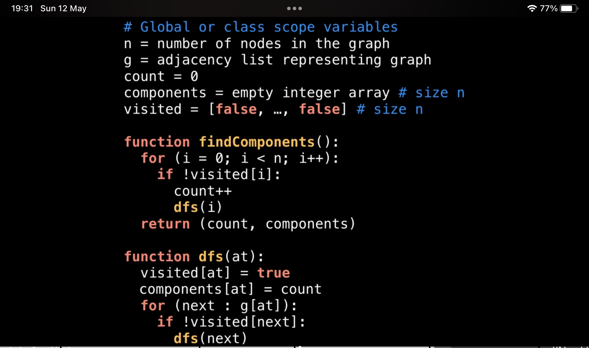

# Ordered dictionary
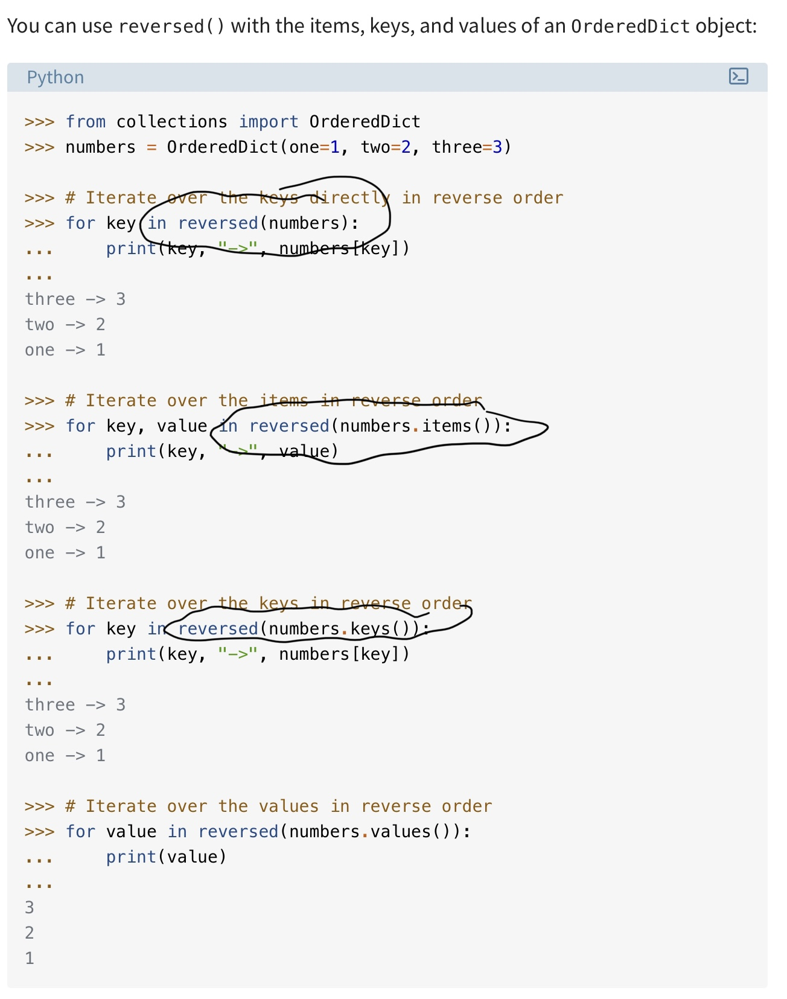
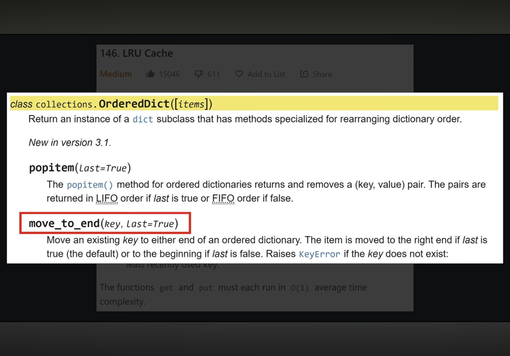

### LRU
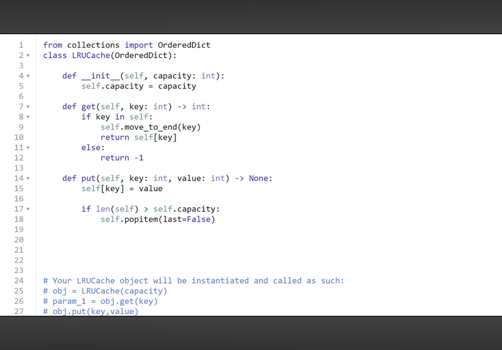

# Sliding window

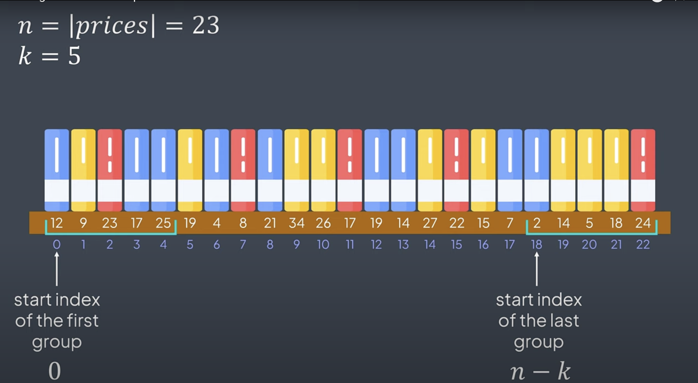

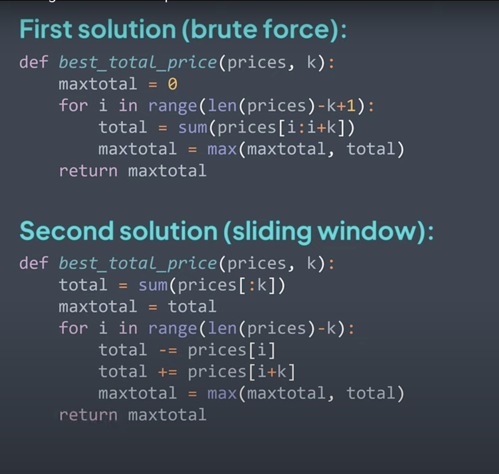

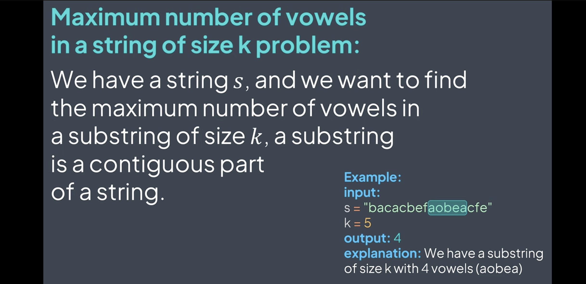

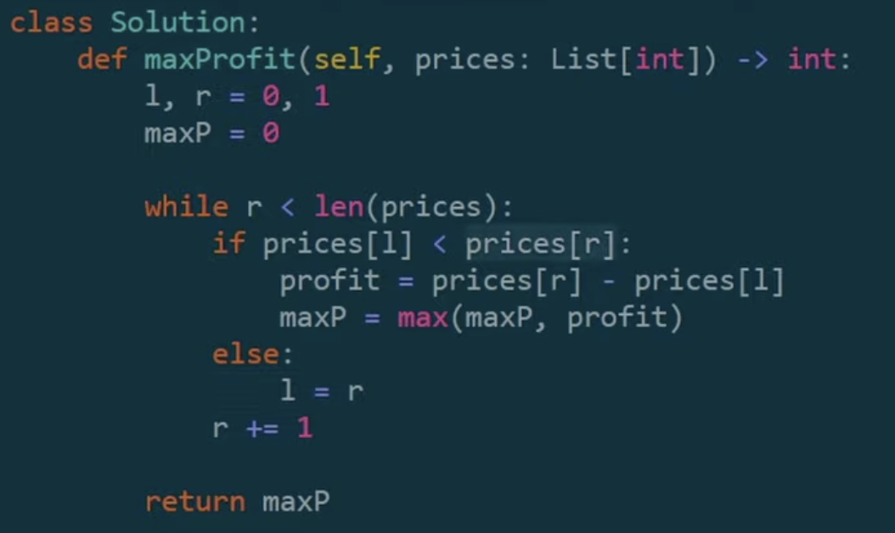